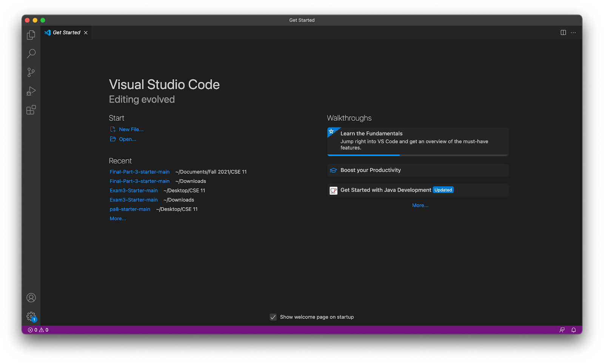
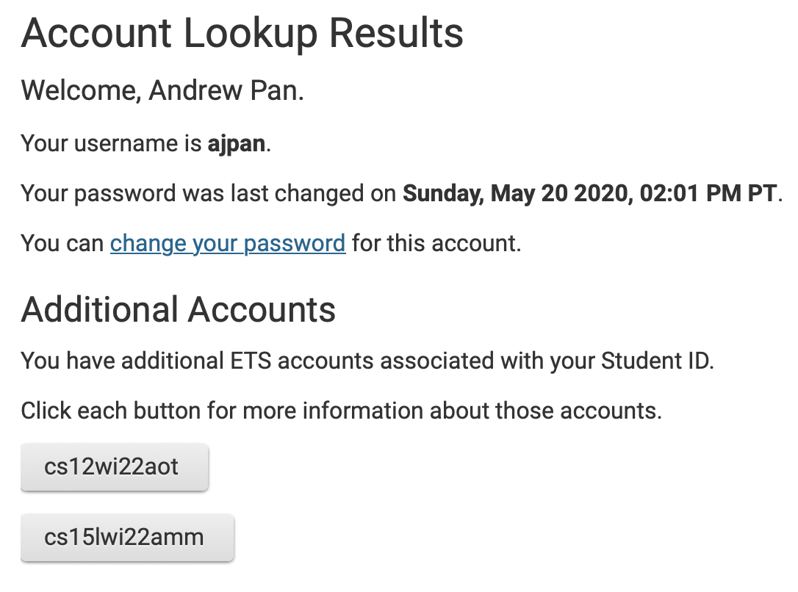
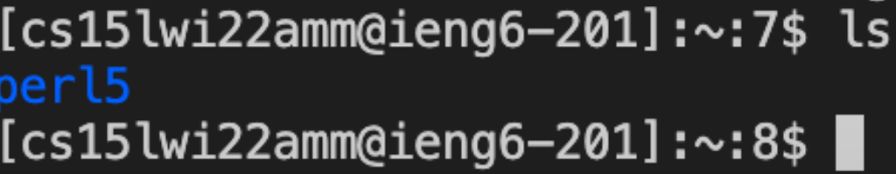
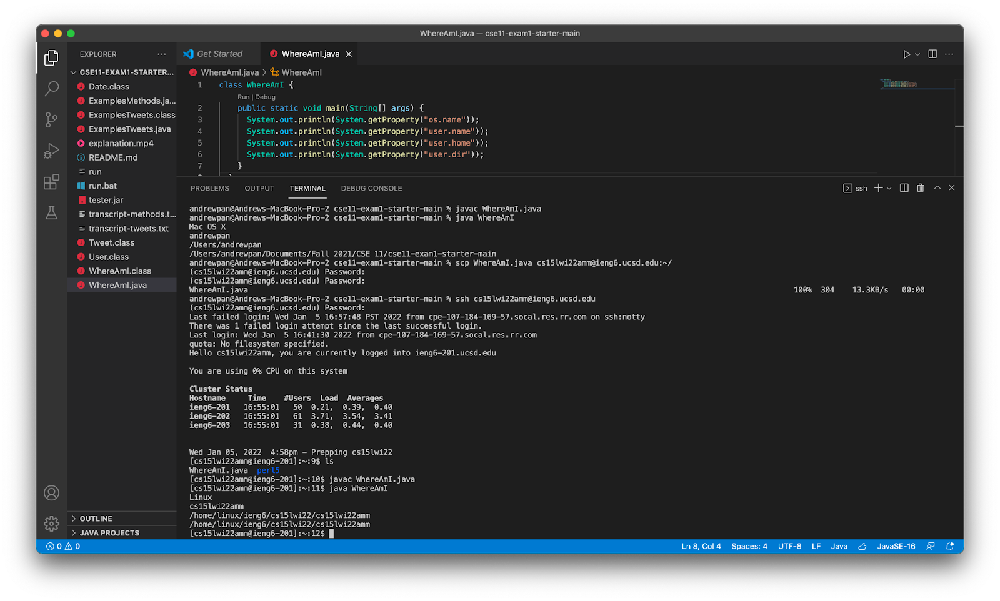
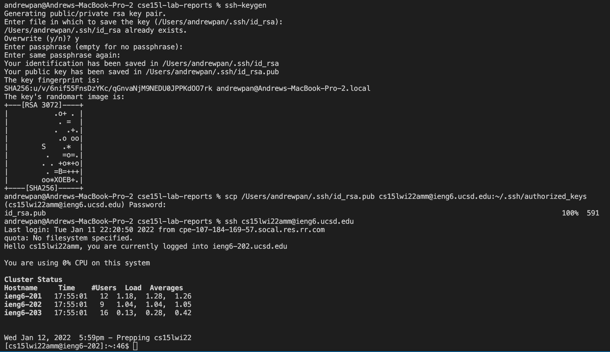
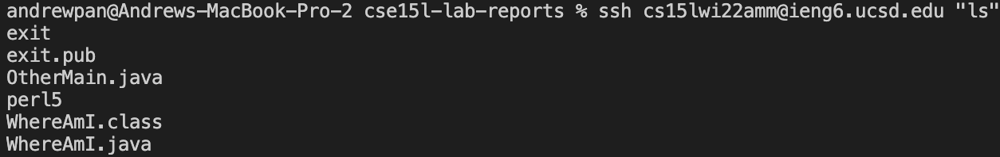
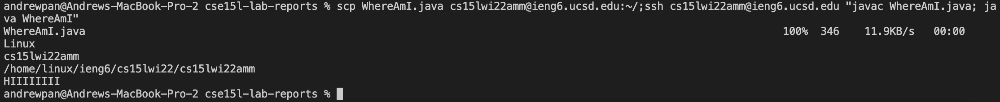
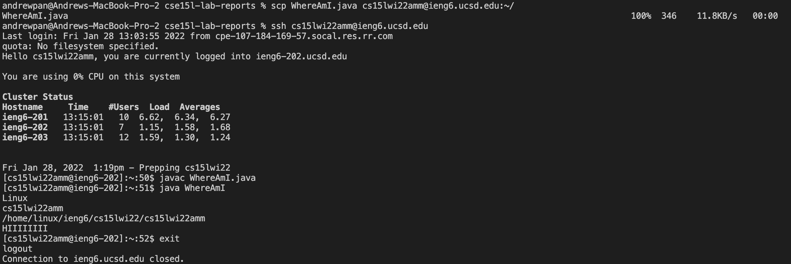
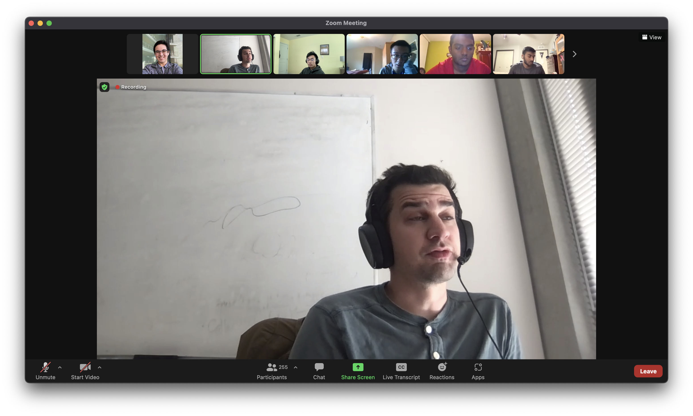

# Lab Report 1 Week 2
`Mac Edition`
### By: Andrew Pan

## 1. Installing VScode
- Download VS Code [here](https://code.visualstudio.com/download).
- Open the downloaded link and follow the instructions on screen to successfully install VS Code.
- Open VS Code to get started! 
## 2. Remotely Connecting
- Lookup your UCSD account info [here](https://sdacs.ucsd.edu/~icc/index.php). 
- Enter your credentials, and then find your cse15l account info under `Additional Accounts` which looks like with `cs15lwi22amm` with `wi22` replaced by the term you're taking the course, and `amm` with your specific username. 
- Then, you have to reset your password by going to the `Change Your Password` hyperlink. Enter your current password, and a new, complicated password following the guidelines on the website. When you're at the last field to `confirm password` press enter on your keyboard. If you get to a screen that says success! or a blank screen, your password was successfully changed. You will use that usernmae and password in the following steps. 
- Next, go back to VS Code and open a new terminal by the menu bar - terminal - new terminal. Run the command ```ssh cs15lwi22amm@ieng6.ucsd.edu``` with your term and username. Say yes that you agree, enter your password, and now you're connected to a computer in the CSE basement! 
## 3. Trying Some Commands
- Now, you're able to run some commands from the terminal that run on the computer in the basement! 
- Here are some to try: `cd`, `ls -a`, `cp /home/linux/ieng6/cs15lwi22/public/hello.txt ~/`
- When you are done, you can logout of the server by typing exit in the terminal, or using `Control D` on your keyboard.
- `ls` lists current elements of directory
## 4. Moving Files with scp
- In VSCode, logged into your computer, make a new file called `WhereAmI.java` with the following content:
    ```
    class WhereAmI {
        public static void main(String[] args) {
            System.out.println(System.getProperty("os.name"));
            System.out.println(System.getProperty("user.name"));
            System.out.println(System.getProperty("user.home"));
            System.out.println(System.getProperty("user.dir"));
            }
    }
    ```
- Then, from the terminal run the command `scp WhereAmI.java cs15lwi22amm@ieng6.ucsd.edu:~/` with your term and username. Enter your password, and now you successfully copied a file to the server! 
- You can run the command using `javac WhereAmI.java` and then `java WhereAmI` and it should print the details of the Linux computer that's in the CSE basement, which is the server you're connected to. 
## 5. Setting an SSH Key
- Exit the server, and then on your computer type `ssh-keygen` into the terminal. 
- Press enter when it says what file to save the key, as well as the passphrase and passphrase again to make it as easy as possible. 
- Then `ssh cs15lwi22zz@ieng6.ucsd.edu` again, enter your password, and type in the command `mkdir .ssh`. Afterwards, you can logout by typing `exit` or `Control D`.
- Then, type in the command `scp /Users/andrewpan/.ssh/id_rsa.pub cs15lwi22amm@ieng6.ucsd.edu:~/.ssh/authorized_keys` with andrewpan replaced with your username on your computer, as well as the username for your account. Enter your password. 
- Then try ssh'ing again, `ssh cs15lwi22amm@ieng6.ucsd.edu`
- Now you're good! You don't have to enter your password every time :)
## 6. Optimizing Remote Running
- To make remote running faster on the server, there are several tips and tricks to optimize your workflow and efficiency.
- You can use `""` after ssh to quickly run those commands on the server and then log out. For example, you can type the command: `ssh cs15lwi22amm@ieng6.ucsd.edu "ls"`, which logs into the remote computer, lists the home directory on the server, and then immediately exits the server. Compared to typing `cs15lwi22amm@ieng6.ucsd.edu`, `ls`, and then `exit` in 3 separate commands, doing it in one command saves 2 keystrokes -- but more importantly, saves 7 seconds of time. Every second definitely adds up especially if you're typing out a lot of commands! 
- You can continually use the `up` arrow key on your keyboard to get previous commands that you ran. This is especially crucial when you're debugging your program and you need to use the same commands to compile and execute your code. If you have `javac` and `java` as your last 2 commands, it only uses 6 keystrokes (4 ups, 2 enters) total to use the  `up` arrow key rather at least 20 keystrokes manually typing the commands again, and saving 12 seconds in my testing. 
- You can run multiple commands at the same time by using `;` like `cp WhereAmI.java OtherMain.java; javac OtherMain.java; java WhereAmI`. While typing this command instead of 3 separate commands the first time doesn't save keystrokes, if you combine it with using the `up` arrow key in the previous suggestion, it'll only require 2 keystrokes (up and enter) to compile and run your code, saving even more time.
- Finally, we're gonna combine all the techniques above  all together. Using the single command `scp WhereAmI.java cs15lwi22amm@ieng6.ucsd.edu:~/; ssh cs15lwi22amm@ieng6.ucsd.edu "javac WhereAmI.java; java WhereAmI"`, you can securly copy an updated `WhereAmI.java` file onto the server, compile and run that file, and then immediately exit the server. If you're making changes to your files and want to continually copy it to the server and run, utilizing the `up` arrow key and this single command only requires 2 keystrokes and less than 2 seconds!  
- Previously, if you did all these commands separately, like in the picture below, it would require 5 separate commands. This includes copying the file onto the server, connecting to the server, compiling, running, and finally exiting the program. Whew, that's a mouthful. Doing it separately took me 30 seconds and significantly more keystrokes. It really does show how efficient you can become by incorporating these tips and tricks into your workflow. 
- If you continue to manually type all your commands, this is the reaction Joe will have: 

- Thanks for following along and hope this tutorial was helpful! Have an amazing day :)