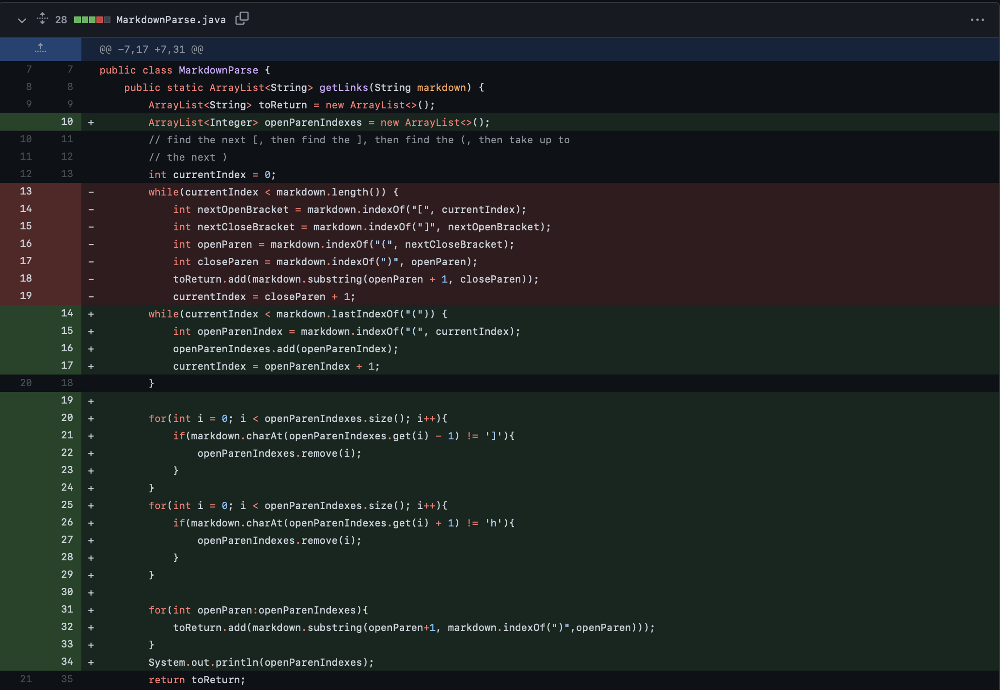
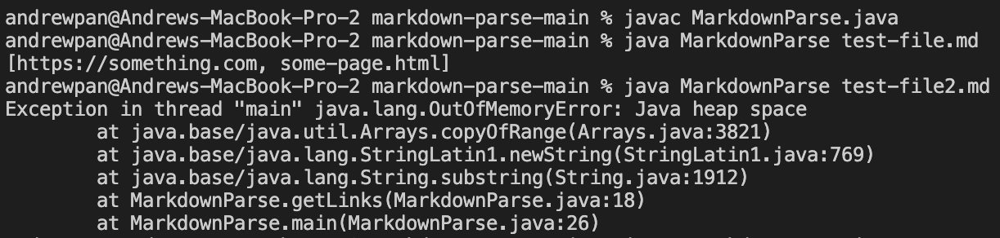
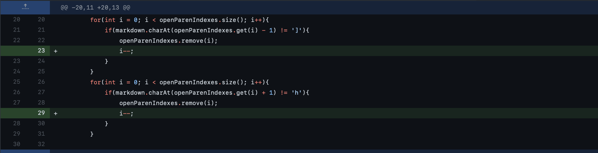
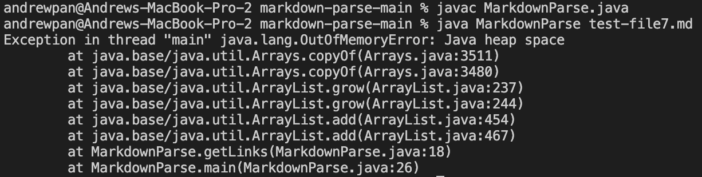
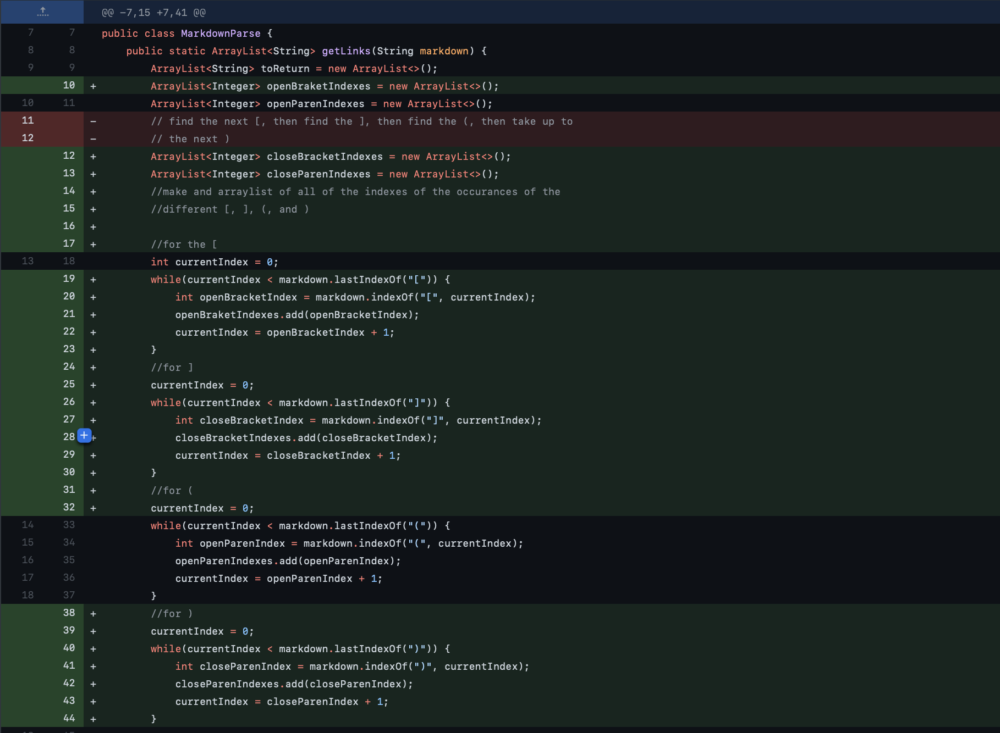
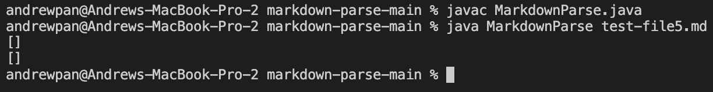

# Lab Report 2 Week 4
`Joe Edition`
### By: Andrew Pan

## 1st Code Change
- Screenshot of code change difference: 
- Link for [test file](https://github.com/pandrew99/markdown-parse/blob/199cf27e0ad562b39487f034d5145235b6a708c9/test-file2.md)
- Symptom 
- Prior to fixing this bug, the failure-inducing input `test-file2.md` was causing the symptom of an infinite while loop. There was text after the links, which caused the program to continue running the while loop with no end in sight. This code change difference still didn't achieve *completely* the right output, but it no longer caused an infinite loop and was able to print one of the links. 

## 2nd Code Change
- Screenshot of code change difference: 
- Link for [test file](https://github.com/pandrew99/markdown-parse/blob/199cf27e0ad562b39487f034d5145235b6a708c9/test-file7.md)
- Symptom 
- Prior to fixing this bug, the failure-inducing input `test-file7.md` was also causing the symptom of an infinite while loop (on a different test file). These changes that we made helped resolve the issues of `test-file7.md`, which contains just `)[` to not have an infinite while loop. However, there are still bugs in the code that we were still in the process of fixing, but this was another situation which was causing an infinite loop and we were able to get that resolved fortunately. 

## 3rd Code Change
- Screenshot of code change difference: 
- Link for [test file](https://github.com/pandrew99/markdown-parse/blob/199cf27e0ad562b39487f034d5145235b6a708c9/test-file5.md)
- Symptom 
- Prior to fixing this bug, the failure-inducing input `test-file5.md`, was printing out 2 sets of `[]`, and not getting the link in the file properly. These issues were also present in the previous code changes, and we were determined to finally fix it once and for all. These changes that we made (adding and fixing our while loops) helped resolve the symptom of incorrect links being printed out, and now links print out properly with no visible symptoms visible to the user!

## Final Thoughts
- Utilizing Github and Github pages to update and share our code is something I haven't really utilized before. Debugging our program and committing & pushing to Github was a good learning experience and insight into how programmers actually work together to solve problems. Moreover, JUnit is still quite new to me from CSE 12, so being able to write and run tests from scratch helped me understand the debugging and testing process better, while being more efficient. These are just a handful of tools that software engineers use everyday to make all our devices run better... and I look forward to continuing to learn more to improve my coding!