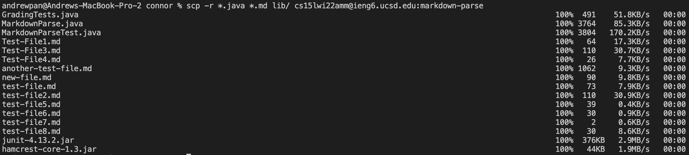
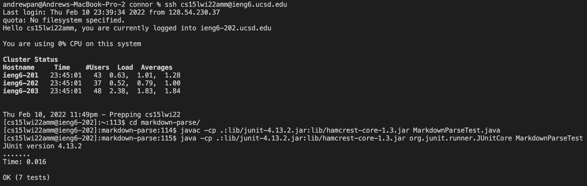
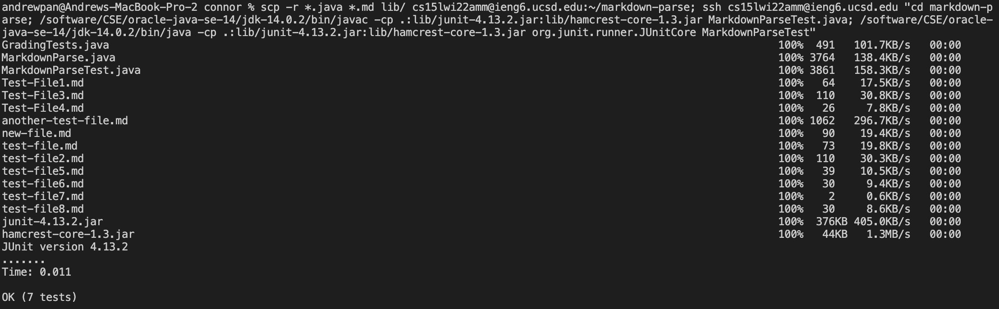

# Lab Report 3 Week 6
`Copy whole directories with scp -r`
### By: Andrew Pan

## Copying your whole markdown-parse directory to your ieng6 account
- 
- To copy the whole directory to the CSE server, you use the command ```scp -r *.java *.md lib/ cs15lwi22amm@ieng6.ucsd.edu:markdown-parse```. This command securely copies all the `.java`,  `.md`, and the `lib` folder recursively to a new folder on the server called `markdown-parse`.

## Logging into your ieng6 account and compiling and running the tests for your repository
- 
- In this step, we first ssh onto the server with `ssh cs15lwi22amm@ieng6.ucsd.edu`, change directory to the folder we just securely copied with `cd markdown-parse/`, and then compile and run the JUnit tests through `javac -cp .:lib/junit-4.13.2.jar:lib/hamcrest-core-1.3.jar MarkdownParseTest.java` and `java -cp .:lib/junit-4.13.2.jar:lib/hamcrest-core-1.3.jar org.junit.runner.JUnitCore MarkdownParseTest` respectively. 

## Combining `scp`, `;`, and `ssh` to copy the whole directory and run the tests in one line
- 
- In this final step, we're combining the above two steps of copying the files over to the server and running the tests in one command. The full command is 
```
scp -r *.java *.md lib/ cs15lwi22amm@ieng6.ucsd.edu:~/markdown-parse; ssh cs15lwi22amm@ieng6.ucsd.edu "cd markdown-parse; /software/CSE/oracle-java-se-14/jdk-14.0.2/bin/javac -cp .:lib/junit-4.13.2.jar:lib/hamcrest-core-1.3.jar MarkdownParseTest.java; /software/CSE/oracle-java-se-14/jdk-14.0.2/bin/java -cp .:lib/junit-4.13.2.jar:lib/hamcrest-core-1.3.jar org.junit.runner.JUnitCore MarkdownParseTest"
```
- Here, I utilized the Oracle javac and java commands since the other commands were not working -- with the problem being my computer and ieng6 having different versions of Java installed. In this command, we securely copy the files over to the server in a new folder `markdown-parse`, log in to the server, change directory, and then compile and run the JUnit tests. Whew! The power of `;` and `""`, which allows us to separate commands and run commands and immediately exit the server, respectively. 

## Story time: when a single quote breaks your command
- After completing the first and second parts successfully, I then combined the commands together and figured everything would go relatively smoothly. Oh boy, was I wrong! I ran the same command above, just with the javac and java instead of the Oracle commands, and then the terminal said something like "bash: cd command not available." I was so confused because like, the cd command is right there buddy!! For the next hour and a half, my roommate and I were trying different things to see what the problem was. Everything looked fine to both me and him, and we tried different things like changing the each command, switching to the Oracle command, making a new directory and folder on the server, and more. Nothing was working. Finally, I was copying the command above, and accidently backspaced the " at the end and then retyped it and noticed something interesting. There are two different types of double quotes! In text editor programs, like Word, Pages, and Notes (which I was using to copy and paste commands from), it autoformats the last quote to be slanted to the right (like in a book), which is different from the regular straight quote that terminal windows expect: ” vs. ". Omg. Although it was quite frustuating, it was very satisfying to finally fix the issue and run the command successfully. Now I know to not use a text editor to store terminal commands, and instead use a coding app/editor like VS Code or Sublime text :)