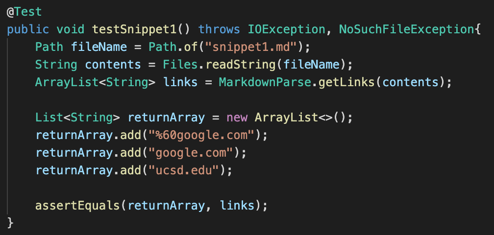
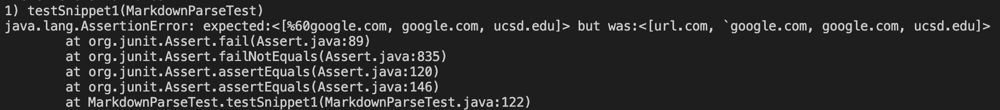
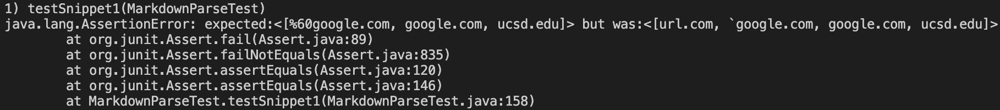
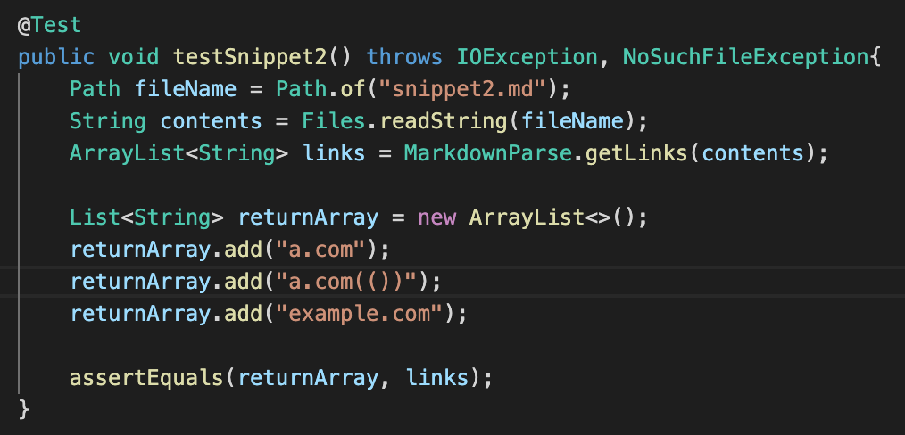
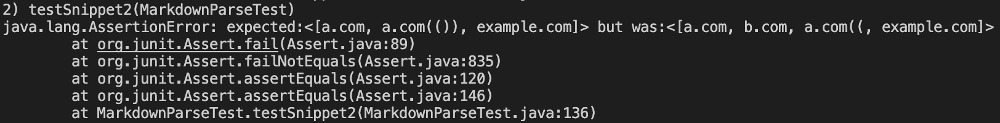
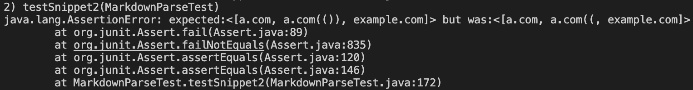
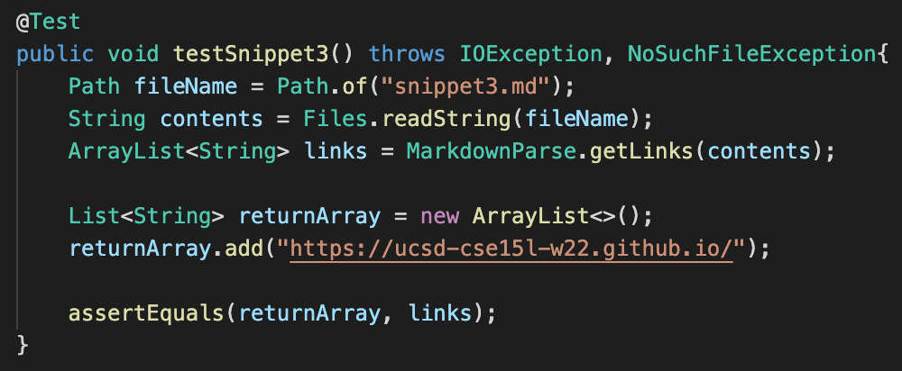
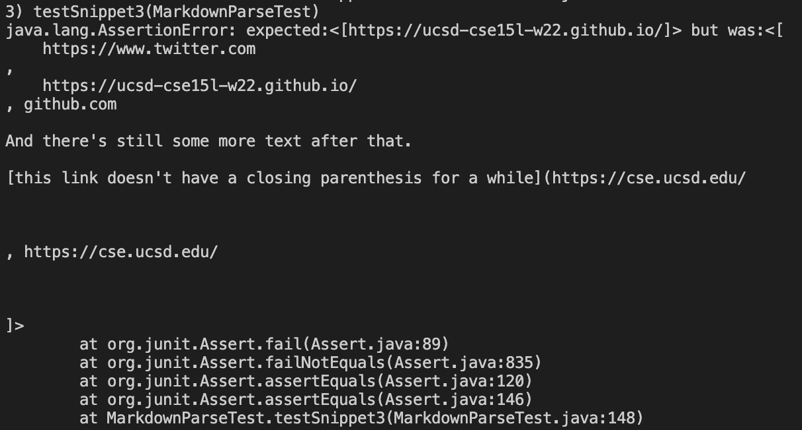
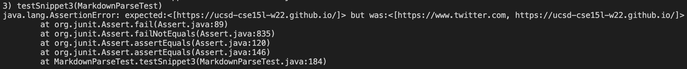

# Lab Report 4 Week 8
`Valid Links, JUnit Tests, Github Repositories, Expected Output`
### By: Andrew Pan

## Markdown-Parse Repositories
- [Our Group](https://github.com/pandrew99/markdown-parse)
- [Reviewed Group](https://github.com/PierreBeur/markdown-parse)

## Snippet 1
- Markdown:
```
`[a link`](url.com)

[another link](`google.com)`

[`cod[e`](google.com)

[`code]`](ucsd.edu)
```
- Expected Output: 
`[%60google.com, google.com, ucsd.edu]`
- JUnit Test
- My Implementation Output
- Reviewed Implementation Output

## Snippet 2
- Markdown:
```
[a [nested link](a.com)](b.com)

[a nested parenthesized url](a.com(()))

[some escaped \[ brackets \]](example.com)
```
- Expected Output: 
`[a.com, a.com(()), example.com]`
- JUnit Test
- My Implementation Output
- Reviewed Implementation Output

### Snippet 3
- Markdown:
```
[this title text is really long and takes up more than 
one line

and has some line breaks](
    https://www.twitter.com
)

[this title text is really long and takes up more than 
one line](
    https://ucsd-cse15l-w22.github.io/
)


[this link doesn't have a closing parenthesis](github.com

And there's still some more text after that.

[this link doesn't have a closing parenthesis for a while](https://cse.ucsd.edu/


)

And then there's more text
```
- Expected Output: 
`[https://ucsd-cse15l-w22.github.io/]`
- JUnit Test
- My Implementation Output
- Reviewed Implementation Output

## Code Change Questions
1. 
- I think there could be code changes in less than 10 lines that could account for inline code with backtacks. 
- There could be code similar to looking for the open/close parentheses/brackets that instead looks for the inline code backticks.
- Specifically, you could have conditionals that check for where the backticks are to determine if the link is valid. If the backticks are within the () or [], then the link is valid. If they're like the first line in snippet 1 where there's a backtick before the [ and before the ] so that the brackets don't finish before the `, then the link isn't valid. 
2. 
- Accounting for snippet 2 and related cases with nested parentheses, brackets, and escaped brackets will probably involve more than 10 lines of code. 
- In lecture last week, Joe was demoing some of the these scanrios and showed GitHub co-pilot and it took more than 10 lines of code. 
- It's kinda complicated because you have to know which parenthesis/bracket is part of the link and which part is part of the style for formatting the link. 
- In addition, there could be more ( or more ) within the valid link so there would be a different amount of ( and ), which we would also have to account for. 
3. 
- I believe accounting for new lines with parenthesis/brackets could be a code change accomplished in less than 10 lines. 
- Since new lines are similar to white space within a line, you could make a code change by get rid of that extra white space and just look for the end parenthesis/bracket. 
- This could be accomplished using a method like trim() and a while loop to continue looking for the next parenthesis and bracket, even if they're on new lines further down the markdown file. 

## Final Thoughts
- This lab report was definitely a learning experience into what counts as a valid link and what doesn't! I wasn't really familiar with markdown files and what valid links were before so it was fun experimenting with these snippets and others to see what counts as a valid links. I'm more familiar with Github, markdown files, and running JUnit tests now so it was definitely faster for me to write and run the tests than previously. All in all, markdown-parse is actually pretty complicated like Joe said...we definitely aren't gonna finish implementing everything so it runs perfectly by the end of the quarter lol. 
