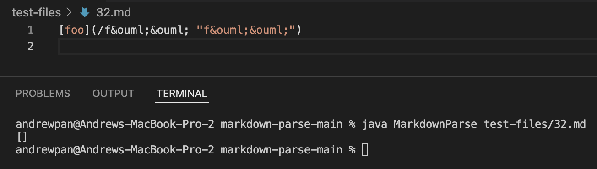
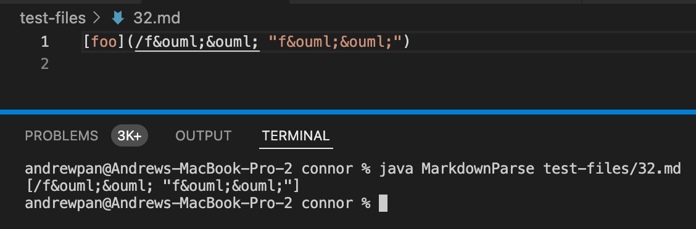
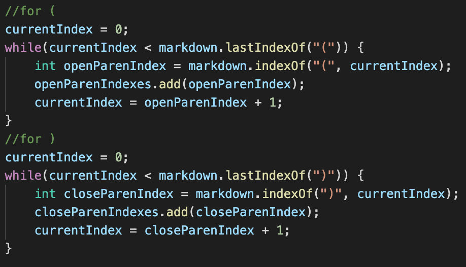
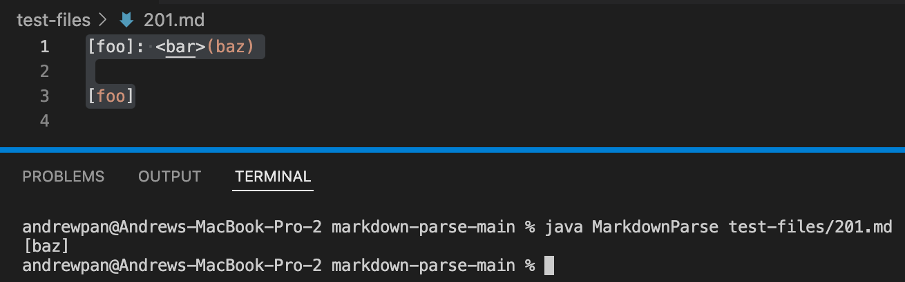
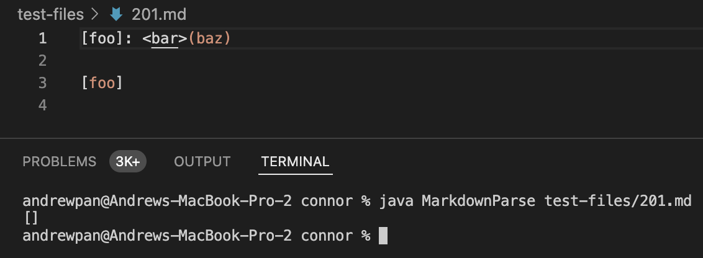
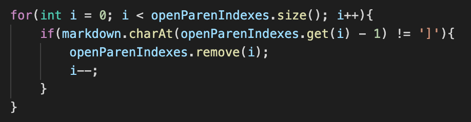
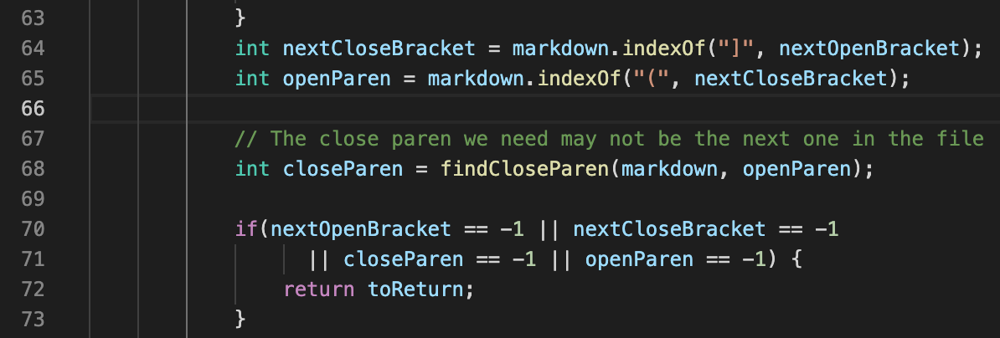

# Lab Report 5 Week 10
`Commonmark Edition`
### By: Andrew Pan

## How I found the tests
- To be honest, I just manually looked through the tests and ran the md files that I thought would cause problems with the expected output not being equal to the actual output. 
- I like the number 33, so I looked at that one and the md files around that number and discovered that `32.md` didn't work for either implementation -- but both had different errors. 
- For the second test, `201.md`, I was just looking through the md files and was skipping around randomly, and found this one doesn't work for Joe's implementation, but works for mine. 
- Ideally, using a faster programmatic idea would be better, especially for running and checking many tests to ensure they are working properly.
- However, since we only needed to look at 2 tests for this lab, I wanted it to be a little more "random" and just pick the tests myself as I stumbled upon them haha.

## Test 1 
### Files and Outputs
- 32.md: 
```
[foo](/f&ouml;&ouml; "f&ouml;&ouml;")
```
- Joe's Implementation Output
- My Implementation Output
- Expected Output: 
`[/f%C3%B6%C3%B6]`
### Neither Implementation is Correct
- Joe's provided implementation doesn't detect that it's a link and produces an empty list, while my implementation detects the link, but includes extra characters not technically part of the link itself. 
- Since my implementation is closer to the expected output, I will discuss the bug in mine. 
- I learned through Commonmark's [website](https://commonmark.org/help/tutorial/07-links.html) that the text within the "" after the actual link within the parenthesis is the title of the website, which is optional.
- However, 32.md tests this functionality and expects just the link itself to be the link. 
- __The Bug:__ my implementation currently detects everything within the () as the link, but doesn't detect that it needs to stop at the "" -- the title of the website. 
- __Possible Solution:__ After the code directly detects the starting parenthesis (, it should check for an empty space, and then double quotes -- which indicates that the link has ended and the title has started. There's likely some links that also have spaces and quotes within them, so it might not be a perfect solution -- but one way to fix the bug. 
- This change should occur between these two while loops in my code:
-  

## Test 2 
### Files and Outputs
- 201.md: 
```
[foo]: <bar>(baz) [foo]
```
- Joe's Implementation Output
- My Implementation Output
- Expected Output: 
`[]`
### My Implementation is Correct
- The expected output is supposed to be an empty ArrayList [] since there are no valid links in 201.md. 
- My implementation correctly produces this output, but Joe's implementation provided during the week 9 lab thinks `baz` between the parenthesis is a link. 
- __The Bug:__ Joe's implementation currently looks for the open parenthesis `(` immediately after looking for the close bracket `]`, which doesn't consider the possibility that there might be other characters between them -- making them not valid links. 
- __Possible Solution:__ The bug can be addressed by checking to make sure the `](` are right next to each other, like in my implementation: 
- 
- This code change could be added on line 66, to check if the int of openParen is one more than nextCloseBracket (which indicate it could be a valid link). If not, it wouldn't be a valid link and wouldn't need to be added to the ArrayList:
-  

## Final Thoughts
- Overall, I learned a lot this quarter about terminal commands, Github, and markdown-parse!
- I definitely don't know every single command by heart right now, but as I practice more and utilize the terminal more, I'll get more comfortable and get the hang of it. 
- Thanks to Joe and the entire TA/tutoring staff for a great quarter! :) 